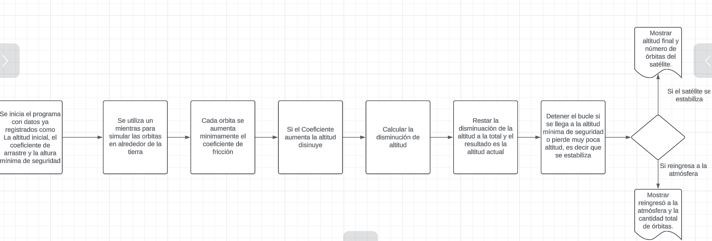

# Análisis


# Diagrama de bloques problema 1


# Reserva de aerolineas
```
Inicio
    
    Definir "Destino" Med-Car=1, Med-Bog=2, Bog-Med=3, Bog-Car=4, Car-Med=5, Car-Bog=6
    
    Definir "Distacia" = Med-Bog=240km, Med-Car=461km, Bog-Car=657km
    
    Definir "asientos" = C-pasillo, A-ventana, B-sin preferencia.
    Leer asientos

    insertar "escribir su título como sr ó sra, su nombre y apellido"
    leer título, nombre y apellido
    
    Dar saludo "título, nombre y apellido, !Bienvenid@ a FastFast Airlines!"

Si
    dar a elegir al usuario las opciones de viaje del 1 al 6
    entonces Lista[1,2,3,4,5,6]
fin si

Si
    usuario ya eligió su destino, elegir el día de la semana y del mes a viajar
    entonces Seleccionar Día semana y Día del mes
fin si

Si
    El usuario desea viajar a una (Distancia < de 400km) de Lunes a Jueves 
    entonces precio=79.900
    Si no
    entonces precio=119.900
fin si

Si
    El usuario desea viajar a una (Distancia >= de 400km) de Lunes a Jueves
    entonces precio=156.900
    Si no
    entonces precio=213.000
fin si

Si
    usuario tiene preferencias 
    entonces elegir asientos: A, B o C.
    si no 
    elegir al azar una letra y un asiento del 1 al 29
    fin si
imprimir resultados
fin
``` 

# Análisis P2


# Diagrama de bloques Problema 2


# Simulador satélite

```
Inicio
    Leer Altitud_Inicial("Altitud en km del satelite: ")
    Leer Altitud_minima_seguridad("Altitud_minima_seguridad en que el satelite puede sobrevivir el satelite: ")
    Leer Coeficiente_arrastre("Coeficiente_arrastre del satelite: ")
    Definir Altitud_Perdida = 0
    Definir Orbitas = 0
    Definir Altitud = Altitud_Inicial
    Mientras Altitud >= Altitud_Minima:
Definir Altitud_Perdida: Altitud*Cd
Definir Altitud = Altitud-Altitud_perdida
Orbitas = Orbitas + 1 
Cd = Cd + 0.001
Si Altitud < Altitud_Minima 
Escribir("Se ha perdido conexión con satelite")
Si Altitud_Perdida <= 0.1
Escribir("Satelite estabilizado")
```

# Auto evaluación

#### *Criterios y calificación*

1-Asistencia y participación: Siento que la calificación deberia de rondar el (4.5-5) debido a que asisto a las clases y en estas hago ciertas preguntas o aportes los cuales pueden favorecer el aprendizaje propio y de mis compañeros.

2-Análisis: La calificación de esta está entre (4-4.5)ya que siento que se me puede dificultar el hecho de identificar lo que se puede insertar por parte del usuario o de lo que se encarga la máquina. Mas que todo el enfoque de lo que son las variables y constantes a veces me puede parecer confuso a la hora de identificarlos.

3-Pseudocódigo: para este criterio la nota está ente (4-4.5) porque siento que me falta práctica a la hora de definir ciertas variables o la manera en la que funciona un blucle, sin embargo siento que el proceso de mejora de estos es mas significante ya que se plantean problemas como estos que involucran ciertos bucles.

4-Organización y presentacion: La calificación está entre (4.5-5) ya que siento que soy organizado a la hora de crear y poner los archivos donde corresponden, haciendo que los procesos de busqueda de los archivos sea menos compleja para el usuario que lo requiera. Ademas de utilizar las carpetas que se proveen con el enlace de github y darles un uso relacionado a lo hecho en clase y con la unidad.