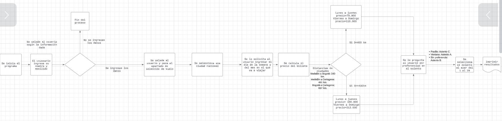

# Análisis


# Diagrama de bloques problema 1


# Reserva de aerolineas
```
Inicio
    
    Definir "Destino" Med-Car=1, Med-Bog=2, Bog-Med=3, Bog-Car=4, Car-Med=5, Car-Bog=6
    
    Definir "Distacia" = Med-Bog=240km, Med-Car=461km, Bog-Car=657km
    
    Definir "asientos" = C-pasillo, A-ventana, B-sin preferencia.
    Leer asientos

    insertar "escribir su título como sr ó sra, su nombre y apellido"
    leer título, nombre y apellido
    
    Dar saludo "título, nombre y apellido, !Bienvenid@ a FastFast Airlines!"

Si
    dar a elegir al usuario las opciones de viaje del 1 al 6
    entonces Lista[1,2,3,4,5,6]
fin si

Si
    usuario ya eligió su destino, elegir el día de la semana y del mes a viajar
    entonces Seleccionar Día semana y Día del mes
fin si

Si
    El usuario desea viajar a una (Distancia < de 400km) de Lunes a Jueves 
    entonces precio=79.900
    Si no
    entonces precio=119.900
fin si

Si
    El usuario desea viajar a una (Distancia >= de 400km) de Lunes a Jueves
    entonces precio=156.900
    Si no
    entonces precio=213.000
fin si

Si
    usuario tiene preferencias 
    entonces elegir asientos: A, B o C.
    si no 
    elegir al azar una letra y un asiento del 1 al 29
    fin si
imprimir resultados
fin
``` 

# Análisis P2


# Diagrama de bloques Problema 2
